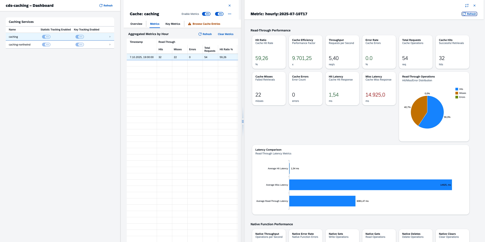
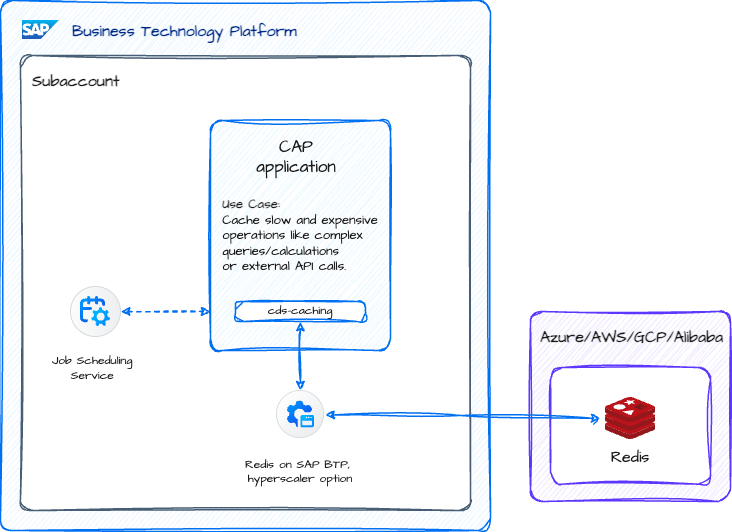

# Welcome to cds-caching

## Overview

This plugin for the [SAP Cloud Application Programming Model (CAP)](https://cap.cloud.sap/docs/) provides a caching service to improve performance in CAP applications.

While CAP in general performs well for most use cases, caching can help with:
- Slow remote service calls
- Complex operations
- Slow queries
- Other performance bottle necks

While cds-caching can be a big helper, an additional caching layer also adds complexity and should be used judiciously.

Please also read the introduction blog post in the SAP Community: [Boosting performance in SAP Cloud Application Programming Model (CAP) applications with cds-caching](https://community.sap.com/t5/technology-blogs-by-members/boosting-performance-in-sap-cloud-application-programming-model-cap/ba-p/14002015).

### Key Features

* **Flexible Key-Value Store** – Store and retrieve data using simple key-based access.
* **CachingService** – A cds.Service implementation with an intuitive API for seamless integration into CAP.
* **Read-Through Capabilities** – Let the caching service handle the cache set and get operatios for you 
* **CAP-specific Caching** – Effortlessly cache CQN queries or CAP cds.Requests using code or the @cache annotation.
* **TTL Support** – Automatically manage data expiration with configurable time-to-live (TTL) settings.
* **Tag Support** – Use dynamic tags for flexible cache invalidation options.
* **Pluggable Storage Options** – Choose between in-memory caching, SQLite or Redis.
* **Compression** – Compress cached data to save memory using LZ4 or GZIP.
* **Integrated Metrics** – Monitor cache performance with hit rates, latencies, and more.
* **API** – Access basic cache operations and metrics via API
* **Event Handling** – Monitor and react to cache events, such as before/after storage and retrieval.

### Checkout detailed information on how to use cds-caching

> - [Programmatic API](docs/programmatic-api.md)
> - [Key Management](docs/key-management.md)
> - [Metrics Guide](docs/metrics-guide.md)
> - [OData API Reference](docs/odata-api.md)

## 🚨 Breaking Changes: Migrating from cds-caching 0.x

> **⚠️ Important:** Version 1.x contains breaking changes. Please review the migration guide below.

### 🔄 API Changes for read-through methods

Version 1.x introduces new methods that provide more insights into the read-through caching as they also directly return the genrated cache `key` and some caching `metadata`. The should be preferrably used instead of the old methods.

| **Old Method** | **New Method** | **Key Differences** |
|----------------|----------------|---------------------|
| `cache.run()` | `cache.rt.run()` | Returns `{result, cacheKey, metadata}` instead of just `result` |
| `cache.send()` | `cache.rt.send()` | Returns `{result, cacheKey, metadata}` instead of just `result` |
| `cache.wrap()` | `cache.rt.wrap()` | Returns `{result, cacheKey, metadata}` instead of just `result` |
| `cache.exec()` | `cache.rt.exec()` | Returns `{result, cacheKey, metadata}` instead of just `result` |

### 🔑 Key Template Changes

**Before (0.x):**
```javascript
// Old syntax - object with template property
await cache.set(query, result, { 
  key: { template: "user:{user}:{hash}" }
})
```

**After (1.x):**
```javascript
// New syntax - direct string template
await cache.set(query, result, { 
  key: "user:{user}:{hash}"
})
```

### 🌍 Context Awareness Changes

**Default Behavior Changed:**
- **0.x:** Context (user, tenant, locale) was automatically included in some cache keys (ODataRequests)
- **1.x:** Context is **disabled by default** and can be enabled for **ALL** keys (unless overwritten)

**To Enable Context Awareness:**
```json
{
  "cds": {
    "requires": {
      "caching": {
        ...
        "keyManagement": {
          "isUserAware": true,      // Include user context in cache keys
          "isTenantAware": true,    // Include tenant context in cache keys
          "isLocaleAware": false    // Include locale context in cache keys
        }
      }
    }
  }
} 
```

### 📚 Migration Examples

**Example 1: Basic Caching**
```javascript
// ❌ Old way (deprecated, but will still work)
const result = await cache.run(query, db)

// ✅ New way
const { result, cacheKey, metadata } = await cache.rt.run(query, db)
```

**Example 2: Function Wrapping**
```javascript
// ❌ Old way (deprecated, but will still work)
const cachedFn = cache.wrap("key", expensiveOperation)
const result = await cachedFn("param1", "param2")

// ✅ New way
const cachedFn = cache.rt.wrap("key", expensiveOperation)
const { result, cacheKey, metadata } = await cachedFn("param1", "param2")
```

**Example 3: Custom Key Templates**
```javascript
// ❌ Old way (will not work anymore)
await cache.set(data, value, { 
  key: { template: "user:{user}:{hash}" }
})

// ✅ New way
await cache.set(data, value, { 
  key: "user:{user}:{hash}"
})
```

### 🔍 What's New

- **Enhanced Metadata:** All read-through operations now return cache keys and performance metadata
- **Better Performance:** Context awareness is opt-in, reducing unnecessary key complexity
- **Improved Debugging:** Access to generated cache keys for troubleshooting
- **Flexible Configuration:** Global and per-operation key template control

For detailed API documentation, see [Programmatic API Reference](docs/programmatic-api.md). 

### Example Application

The cds-caching plugin includes a comprehensive example application demonstrating various caching use cases and a UI5-based dashboard for monitoring cache performance.



The example consists of:
- **Backend Application** (`examples/app/`) - A CAP application showing annotation-based and programmatic caching patterns
- **Dashboard** (`examples/dashboard/`) - A UI5-based monitoring interface with real-time metrics, key-level analytics, and historical data

[See the full Example Application Guide →](docs/example-app.md)


### Installation

Installing and using cds-caching is straightforward since it's a CAP plugin. Simply run:

```bash
npm install cds-caching
```

### Configuration

The cds-caching plugin supports comprehensive configuration through `package.json`. Here are all available configuration options:

#### Basic Service Configuration

**Minimal setup** (in-memory cache for development):

```json
{
  "cds": {
    "requires": {
      "caching": {
        "impl": "cds-caching",
        "namespace": "caching"
      },
      // Recommended: Define a specific caching service for different caching requirements
      "bp-caching": {
        "impl": "cds-caching",
        "namespace": "bp-caching"
      }
    }
  }
}
```

**Advanced configuration** with all options:

```json
{
  "cds": {
    "requires": {
      "caching": {
        "impl": "cds-caching",
        "namespace": "caching",
        "store": "in-memory", // "in-memory", "sqlite", or "redis"
        "compression": "lz4", // "lz4" or "gzip"
        "credentials": {
          // Redis configuration
          "host": "localhost",
          "port": 6379,
          "password": "optional",
          "url": "redis://..." // Alternative: Redis connection URI
          
          // SQLite configuration
          "url": "sqlite://./cache.sqlite",
          "table": "cache",
          "busyTimeout": 10000
        }
      }
    }
  }
}
```

#### Read-Through (RT) Key Configuration

Configure default key templates for read-through operations:

```json
{
  "cds": {
    "requires": {
      "caching": {
        ...
        "keyManagement": {
          "isUserAware": true,      // Include user context in cache keys
          "isTenantAware": true,    // Include tenant context in cache keys
          "isLocaleAware": false    // Include locale context in cache keys
        }
      }
    }
  }
}  
```

**Default behavior** (if not configured): All context elements are disabled by default.

#### Environment-Specific Configuration

You can override settings for different environments:

```json
{
  "cds": {
    "requires": {
      "caching": {
        "impl": "cds-caching",
        "store": "redis",
        "[development]": {
          "credentials": {
            "host": "localhost",
            "port": 6379
          }
        },
        "[production]": {
          "credentials": {
            "url": "redis://production-redis:6379"
          }
        }
      }
    }
  }
}
```

For detailed information on RT key generation and advanced configuration options, see [Key Management](docs/key-management.md) and [Programmatic API Reference](docs/programmatic-api.md).

### Service Definition

Add the following cds definition to your data model:

```
using {plugin.cds_caching.CachingApiService} from 'cds-caching/index.cds';

// Don't forget to protect the service, e.g. 
annotate CachingApiService with @requires: 'authenticated-user';
```

### Real-World Usage and Deployment


#### Storage Options

cds-caching provides 3 storage options:

##### In-Memory Cache (for development / small-scale uses)
- Simple and fast, but not persistent
- Not suitable for production since Node.js runtime memory is limited
- Data is lost when the application restarts
- Memory on SAP BTP Cloud Foundry is limited (up to 16 GB) and produces costs

##### SQLite (for medium-size use uses)
- Data is stored in local SQLite database
- Data is persited next to SAP BTP application with disk-quota up to 10 GB
- Cache will be removed after each deployment to SAP BTP
- No distributed cache between application instances (horizontal scaling)

##### Redis Cache (recommended for production)
- Persistent and supports distributed caching
- Works across multiple app instances, making it ideal for scalable applications
- Available on SAP BTP via hyperscaler options (e.g., AWS, Azure, Google Cloud)
- Even trial accounts provide Redis access

#### Redis Development Setup

##### Running Redis Locally via Docker
For local development, Redis can be quickly set up using Docker. A simple docker-compose configuration provides a lightweight caching environment:

1. Create a `docker-compose.yml` file:
```yaml
services:
  redis:
    image: redis:latest
    container_name: local-redis
    ports:
      - "6379:6379"
```

2. Run Redis with: 
```bash
docker compose up -d
```

3. Modify the `package.json` configuration to connect to the local Redis instance:
```json
{
  "cds": {
    "requires": {
      "caching": {
        "impl": "cds-caching",
        "namespace": "myCache",
        "store": "redis",
        "[development]": {
          "credentials": {
            "host": "localhost",
            "port": 6379
          }
        }
      }
    }
  }
}
```

Now, caching will be handled by Redis instead of in-memory storage during development.

#### Production Deployment on SAP BTP



For production deployments on SAP BTP, Redis can be provisioned as a managed service through the Redis on SAP BTP hyperscaler option. An instance can be provisioned via trial or even as a Free Tier to explore the service. However, for production scenarios the size of the Redis instance should match your caching requirements.

To bind Redis to your CAP application on SAP BTP, add the following configuration in `mta.yaml`. This will automatically create the service instance and bind your application to it. Since the credentials will automatically be fetched by CAP, make sure to maintain the service-tags to match the kind property of your cds-caching service(s) in the package.json:

```yaml
modules:
  - name: cap-app-srv
    # ... other module configuration ...
    requires:
      - name: redis-cache

resources:
  - name: redis-cache
    type: org.cloudfoundry.managed-service
    parameters:
      service: redis-cache
      service-plan: trial
      service-tags:
        # Must match the kind property in the package.json
        - cds-caching
```

> 👉 **Tip**: There is a detailed [blog series on Redis in SAP BTP](https://community.sap.com/t5/technology-blogs-by-sap/redis-on-sap-btp-understanding-service-entitlements-and-metrics/ba-p/13738371) explaining how to set up Redis and connect via SSH for local/hybrid testing, as this is by default not possible.


### Usage Patterns

> ⚠️ **Deprecation Notice**: The following methods are deprecated since version 1.0 and will be removed in a future version:
> - `cache.run()` - use `cache.rt.run()` instead
> - `cache.exec()` - use `cache.rt.exec()` instead  
> - `cache.wrap()` - use `cache.rt.wrap()` instead
> - `cache.send()` - use `cache.rt.send()` instead
>
> The `rt.xxx` methods provide enhanced functionality including:
> - **Read-through metadata**: Information about cache hits/misses and latency
> - **Consistent return format**: All methods return `{ result, cacheKey, metadata }` by default
>
> **Migration**: Simply replace `cache.method()` with `cache.rt.method()` and access the result via `.result` property if needed.

The caching service provides a flexible API for caching data in CAP applications ([full API](docs/programmatic-api.md)). Here are the key usage patterns:
#### 1. Low-Level Key-Value API for Read-Aside Caching

The most basic way to use cds-caching is through its key-value API:

```javascript
// Connect to the caching service
const cache = await cds.connect.to("caching")

// Store a value (can be any object)
await cache.set("bp:1000001", businessPartnerData)

// Retrieve the value
await cache.get("bp:1000001") // => businessPartnerData

// Check if the key exists
await cache.has("bp:1000001") // => true/false

// Delete the key
await cache.delete("bp:1000001")

// Clear the whole cache
await cache.clear()
```

#### 2. CQN Query Caching

For more advanced CAP integration, cache CAP's CQN queries directly. By passing in the query, a dynamic key is generated based on the CQN structure of the query. Note, that passing in queries with dynamic parameters (e.g. `SELECT.from(Foo).where({id: 1})`) will result in a different key for each query execution.

```javascript
// Create and execute a CQN query
const query = SELECT.from(BusinessPartners).where({ businessPartnerType: '2' })
const result = await db.run(query)

// Cache the result
await cache.set(query, result)

// Retrieve from cache using the same query
const cachedResult = await cache.get(query)
```
Handling the cache manually via read-aside pattern is possible, but the caching service provides a more convenient way to cache and retrieve CQN queries. By using the `rt.run` method, the caching service will transparently cache the result of the query and return the cached result if available for all further requests.

```javascript
const query = SELECT.from(BusinessPartners).where({ businessPartnerType: '2' })

// Runs the query internally and caches the result
const { result } = await cache.rt.run(query, db)
```


Because the cache key has been dynamically created at runtime, it will also be returned:

```javascript
// Access the cacheKey for later usage
const { result, cacheKey } = await cache.rt.run(query, db)
```

#### 3. RemoteService Request-Level Caching

Cache entire CAP requests with context awareness (e.g. user, tenant, locale, etc.), which is useful for caching slow remote service calls or even application services. The caching service will automatically generate a key for the request based on the request object and the current user, tenant and locale (if not configured otherwise).

```javascript
// Cache the requests to an exposed external entity
this.on('READ', BusinessPartners, async (req, next) => {
  const bupa = await cds.connect.to('API_BUSINESS_PARTNER')
  let value = await cache.get(req)
  if(!value) {
    value = await bupa.run(req)
    await cache.set(req, value, { ttl: 30000 })
  }
  return value
})
```

Alternatively use read-through caching via the `rt.run` method to let the caching service handle the caching transparently:

```javascript
this.on('READ', BusinessPartners, async (req, next) => {
  const bupa = await cds.connect.to('API_BUSINESS_PARTNER')
  const { result } = await cache.rt.run(req, bupa)
  return result
})

```

This will transparently cache the result of the request and return the cached result if available for all further requests.

### 4. ApplicationService Request-Level Caching


> Caching an entire entity should be used with caution, as it will cache all permutations of requests ($select, $filter, $expand, $orderby, etc.) on the entity, which may lead to a huge number of cache entries. Use this only for entities where you can guarantee a low number of different queries.


But not only external services can be cached, it's also possible to cache requests against an ApplicationService.
Here, you should make use of the [`prepend`](https://cap.cloud.sap/docs/node.js/core-services#srv-prepend) function, to register the `on` handler before the default handler. Thus, it is possible to first check for the cache entries and only execute the default behavior if necessary.


```javascript
class MyService extends cds.ApplicationService {
  async init() {

    // Read-through caching for the full entity
    this.prepend(() => {
      const { MyEntity } = this.entities;
      this.on('READ', MyEntity, async (req, next) => {
        const cache = cds.connect.to("caching");
        const { result } = await cache.rt.run(req, next)
        return result;
      });
    });
    return super.init()
  }
}
```

#### 5. ApplicationService Request-Level Caching with Annotations

Alternatively to doing this via code, you can use annotations to enable caching on service entities or OData functions. The caching service will automatically generate a key for the request based on the request object and the current user, tenant and locale. 

```
service MyService {
  @cache: {     
    ttl: 10000 // 10 seconds
  }
  entity BusinessPartners as projection on BusinessPartner {
    // ... entity definition
  }


  @cache: {
    ttl: 100000, // 10 seconds
    tags: [{
      template: 'user-{user}'
    }]
  }
  function getUserPreferences() returns array of Preferences;
}
```

#### 5. Function Caching

While not directly related to CAP functionality, the caching service provides two methods for read-through caching of JavaScript functions:

```javascript
// Using wrap() to create a cached version of a function
const fetchBusinessPartnerData = async (businessPartnerId, includeAddresses) => {
  // ... some expensive computation to fetch BP data
  return businessPartnerData
}

// Creates a cached version of the function.
const cachedBpOperation = cache.rt.wrap("bp-data", fetchBusinessPartnerData, { 
  ttl: 3600,
  tags: ['business-partner']
})

// Each call checks cache first, only executes if cache miss
const result = await cachedBpOperation("1000001", true)

// Using exec() for immediate execution with caching
const result = await cache.rt.exec("product-data", async (productId) => {
  // ... some expensive computation to fetch product data
  return productData
}, ["1000001"], { 
  ttl: 3600,
  tags: ['product']
})
```

The key differences between `rt.wrap()` and `rt.exec()`:
- `rt.wrap()` returns a new function that includes caching logic
- `rt.exec()` immediately executes the function and caches the result
- Use `rt.wrap()` when you need to reuse the cached function multiple times
- Use `rt.exec()` for one-off executions with caching

#### Dynamic Key Generation

All `rt.xxx` methods automatically generate dynamic cache keys based on function arguments (`wrap`, `exec`) and request/query parameters. This ensures that different function calls with different arguments are cached separately.

```javascript
// Different arguments = different cache keys
const result1 = await cachedBpOperation("1000001", true)  // Cache key: "bp-data:1000001:true"
const result2 = await cachedBpOperation("1000002", false)  // Cache key: "bp-data:1000002:false"
```

You can override this behavior by providing a custom key template:

```javascript
const cachedOperation = cache.rt.wrap("bp-profile", fetchBusinessPartnerData, {
  key: "profile:{args[0]}:{args[1]}"
})
```

For detailed information on how read-through keys are generated and configured, see [Key Management](docs/key-management.md).

### Cache Invalidation Strategies

The caching service provides different strategies to invalidate cached values.

**IMPORTANT: You should not use cds-caching without a proper invalidation strategy.**

#### 1. Time-Based (TTL)

The most basic strategy is to use a time-to-live (TTL) for the cache. The caching service will automatically delete the value from the cache after the specified TTL has expired.
The TTL can be specified for individually through all cache methods (e.g. `set`, `run`, `send`, `wrap`, `exec`).

```javascript
// Store with 60 seconds TTL
await cache.set("key", "value", { ttl: 60000 })

// Run with 30 seconds TTL
const { result } = await cache.rt.run(query, db, { ttl: 30000 })

// Send with 10 seconds TTL
const { result } = await cache.rt.send(request, service, { ttl: 10000 })

// Wrap with 10 seconds TTL
const cachedOperation = cache.rt.wrap("key", expensiveOperation, { ttl: 10000 })

// Exec with 10 seconds TTL
const { result } = await cache.rt.exec("key", async () => {
  // ... some expensive computation
  return result
}, [] { 
  ttl: 10000
})
```

#### 2. Key-Based

Key-based invalidation is a way to invalidate cache entries based on a specific key.

```javascript
await cache.delete("key")
```

Keys are critical for cache invalidation. To allow custom key management, you can override the auto-generated key. This option is available for all essential methods (e.g cache.set, cache.rt.run, cache.rt.send, cache.createKey) and for the annotations.

**Read-Through (RT) Methods**: All `rt.xxx` methods automatically generate dynamic cache keys and return them in the response. The generated keys include configurable context (user, tenant, locale) and a content hash. For detailed information on RT key generation, see [Key Management](docs/key-management.md).
 
```javascript
// No key override given, string will just be used as keys
await cache.set('bp:1000001', businessPartnerData) // key: bp:1000001

// No key override given, objects will be smartly hashed 
await cache.set(SELECT.from(BusinessPartners)) // key: bd3f3690d3e96a569bd89d9e207a89af

// Automatically build the key for retrieval/deletion
cache.createKey(SELECT.from(BusinessPartners)) // key: bd3f3690d3e96a569bd89d9e207a89af

// Override and use your own key based on a fixed value
await cache.set(SELECT.from(BusinessPartners, 1000001), { key: "bp:1000001" })

// RT methods return the generated cache key
const { result, cacheKey } = await cache.rt.run(query, db)
console.log('Generated key:', cacheKey) // e.g., "tenant-acme:user-john:locale-en:hash-abc123"

// Override RT key template for requests
await cache.rt.run(req, remoteService, { key: "mykey:{tenant}:{user}:{locale}:{hash}" })

// This requests will be cached for all users and for each locale 
await cache.rt.run(req, remoteService, { key: "mykey:{user}:{locale}:{hash}" })

// Function wrapping with custom key template
const cachedFunction = cache.rt.wrap("user-data", expensiveOperation, {
  key: "user:{user}:{args[0]}"
})
```

#### 3. Tag-Based

Tags are a way to invalidate cache entries based on a specific tag. Tags need to be provided explicitly when storing a value in the cache and are supported for all cache methods (e.g. `set`, `rt.run`, `rt.send`, `rt.wrap`, `rt.exec`).
Tags can be provided as an array of strings or as an array of objects with the following properties:
- `value`: The value to use for the tag.
- `data`: A field from the value to use for the tag. This is working for objects and arrays of objects.
- `prefix`: A prefix that will be added to the tag.
- `suffix`: A suffix that will be added to the tag.
- `template`: A template string that will be used to generate the tag (e.g. `{tenant}-{locale}-{user}-{hash}`). This is useful for dynamic tags based on cds.Requests. 
Templates support the following properties:
  - `{user}`: The current user
  - `{tenant}`: The current tenant
  - `{locale}`: The current locale
  - `{hash}`: The hash of the current query


```javascript
// Store with static tag
await cache.set("bp:1000001", businessPartnerData, { 
  tags: [{ value: "bp-1000001" }] 
})

// Store with template tag (will generate a tag like "tenant-global-user-anonymous")
await cache.set("bp:1000001", businessPartnerData, { 
  tags: [{ template: "tenant-{tenant}-user-{user}" }] 
})

// Store with data-based tag
await cache.set("product:1000001", { productId: 1000001, name: "Laptop Computer" }, { 
  tags: [{ data: "productId", prefix: "product-" }] 
})

// Invalidate by tag
await cache.deleteByTag('bp-1000001')
```
This is really useful for invalidating cache entries based on a specific attribute or context.

#### 3. Dynamic Tags

Dynamic tags using data `data` property are a way to invalidate cache entries based on the data itself. The caching service will automatically generate a tag for the value and invalidate the cache entry when the value changes.

```javascript

const businessPartners = [
  {
    businessPartner: 1000001,
    name: 'Acme Corporation'
  },
  {
    businessPartner: 1000002,
    name: 'Tech Solutions Ltd'
  }
]

// Store with dynamic tags
await cache.set("bp-list", businessPartners, { 
  tags: [
    { data: 'businessPartner', prefix: 'bp-' },
    { value: "businessPartner" }
  ]
})

// Introspect the tags
const tags = await cache.tags("bp-list") // => ["bp-1000001", "bp-1000002", "businessPartner"]

// Invalidate by tag
await cache.deleteByTag('bp-1000001')
await cache.deleteByTag('bp-1000002')
```

This is really usefull for caching results with multiple rows where you can't predict the tags beforehand or when you want to invalidate cache entries based on the data itself. This is also possible for the `rt.run` method.

```javascript
const result = await cache.rt.run(query, db, { 
  tags: [{ data: 'businessPartner', prefix: 'bp-' }]
})
```

This will transparently cache the result of the query and create a tag for each business partner in the result. If you use the same technique in other places and you want to invalidate the cache entries for a specific business partner, you can do this by simply invalidating the tag `bp-1`.

### Cache Iteration

The caching service provides an iterator interface to traverse all cache entries:

```javascript
const iterator = await cache.iterator()

for await (const entry of iterator) {
  console.log(entry)
}
```

This will return an iterator over all cache entries. You can use this to traverse all cache entries and invalidate them based on a specific condition. You should only use this for small caches (e.g. by using multiple caching services with different namespaces).

### TypeScript Support

cds-caching includes comprehensive TypeScript definitions. The library is written in JavaScript but provides full TypeScript support for better development experience.

#### Basic Usage with TypeScript

```typescript
import { CachingService, CacheOptions, ReadThroughResult } from 'cds-caching';

const cache = await cds.connect.to('caching') as CachingService;

// Basic cache operations
await cache.set('my-key', { data: 'value' }, { ttl: 3600 });
const value = await cache.get('my-key');

// Read-through operations with full type safety
const { result, cacheKey, metadata } = await cache.rt.send(request, service, {
  ttl: 1800,
  tags: ['user-data']
});

// Function wrapping with type inference
const cachedFunction = cache.rt.wrap('expensive-operation', async (id: string) => {
  return await this.performExpensiveOperation(id);
});

const { result: operationResult } = await cachedFunction('user-123');

```

### OData Service Caching Considerations

While caching individual requests can improve performance, **caching an entire OData service is generally not recommended**. Here's why:

1. **Data Consistency**: OData services expose live business data that frequently changes. Caching responses without an appropriate invalidation strategy can lead to outdated or incorrect data being served.

2. **Query Complexity**: OData allows dynamic query parameters ($filter, $expand, $orderby, etc.), making it difficult to cache efficiently without storing excessive variations.

3. **Payload Size**: Full OData responses can be significantly large, consuming cache memory inefficiently compared to caching targeted CQN queries or specific request results.

Instead of caching entire OData service responses, focus on:
- Specific queries or request results
- Static master data
- Computed results
- Remote service calls with stable data

### Best Practices

1. **Cache Selectively**: Not all data benefits from caching. Focus on:
   - Frequently accessed, rarely changed data
   - Computationally expensive operations
   - Remote service calls with stable data

2. **Use Appropriate TTLs**: Set TTLs based on data volatility:
   - Short TTLs (seconds/minutes) for frequently changing data
   - Longer TTLs (hours/days) for stable reference data

3. **Implement Cache Tags**: Use tags for granular cache invalidation:
   - Group related cache entries
   - Enable targeted invalidation
   - Use dynamic tags for user/tenant-specific caching

4. **Monitor Cache Performance**: Regularly check cache statistics:
   - Hit rates
   - Memory usage
   - Response times
   - Error rates

### Limitations and Considerations

1. **Memory Usage**: Monitor cache size, especially with in-memory storage
2. **Consistency**: Consider data freshness requirements when setting TTLs
3. **Multi-Tenant**: Use appropriate namespacing and key strategies
4. **Redis Setup**: Ensure proper configuration for production use

## Enhanced Statistics & Monitoring

The plugin now includes comprehensive statistics and monitoring capabilities that provide deep insights into cache performance and help optimize cache usage.

[See the full Metrics Guide →](docs/metrics-guide.md)

### Key Features

- **Real-time Metrics**: Monitor cache performance with detailed hit rates, latencies, and throughput
- **Key-level Tracking**: Track performance metrics for individual cache keys
- **Historical Data**: Store and analyze metrics over time (hourly/daily periods)
- **Performance Analytics**: Calculate cache efficiency, error rates, and response times
- **Runtime Configuration**: Enable/disable metrics at runtime without restart
- **API Access**: Access metrics programmatically or via OData service

### Metrics Overview

cds-caching provides two types of metrics:

#### 1. General Cache Metrics
Track overall cache performance including:
- **Hit/Miss Statistics**: Total hits, misses, and hit ratios
- **Latency Metrics**: Average, min, max, and percentile latencies for hits and misses
- **Performance Metrics**: Throughput (requests/second), error rates, cache efficiency
- **Memory Usage**: Current memory consumption and item count
- **Native Operations**: Counts of direct cache operations (set, get, delete, etc.)

#### 2. Key-level Metrics
Track performance for individual cache keys including:
- **Key-specific Statistics**: Hits, misses, and hit ratios per key
- **Context Information**: Data type, service name, entity name, operation type
- **Enhanced Metadata**: Query text, request info, function names, user/tenant context
- **Performance Tracking**: Latency and throughput metrics per key

### Enabling Metrics

Metrics are disabled by default to minimize performance impact. They can only be enabled/disabled via the programmatic API or OData API at runtime, not through package.json configuration.

To enable metrics programmatically:

```javascript
// Connect to the caching service
const cache = await cds.connect.to("caching")

// Enable metrics at runtime
await cache.setMetricsEnabled(true)
await cache.setKeyMetricsEnabled(true)
```

Or via OData API:

```http
### Enable general metrics
POST http://localhost:4004/odata/v4/caching-api/Caches('caching')/setMetricsEnabled
Content-Type: application/json

{
  "enabled": true
}

### Enable key-level metrics
POST http://localhost:4004/odata/v4/caching-api/Caches('caching')/setKeyMetricsEnabled
Content-Type: application/json

{
  "enabled": true
}
```

### Accessing Metrics via Caching Service

The caching service provides comprehensive metrics collection and persistence capabilities. Metrics are automatically collected during cache operations and can be accessed both in real-time and from historical data.

#### Metrics Persistence

**Transient Metrics**: Current statistics are kept in memory and provide real-time insights into cache performance:
- Hit/miss ratios
- Current latency statistics
- Active cache entries
- Key-level performance data

**Persisted Metrics**: Historical data is automatically stored in the database for long-term analysis:
- Hourly aggregated statistics
- Key-level metrics over time
- Performance trends and patterns
- Cache efficiency analysis

#### Current Statistics

```javascript
// Connect to the caching service
const cache = await cds.connect.to("caching")

// Get current statistics
const stats = await cache.getCurrentStats()
console.log('Hit ratio:', stats.hitRatio)
console.log('Average hit latency:', stats.avgHitLatency)
console.log('Throughput:', stats.throughput)

// Get current key metrics
const keyMetrics = await cache.getCurrentKeyMetrics()
for (const [key, metrics] of keyMetrics) {
    console.log(`Key ${key}:`, {
        hits: metrics.hits,
        misses: metrics.misses,
        hitRatio: metrics.hitRatio,
        avgHitLatency: metrics.avgHitLatency
    })
}
```

#### Historical Metrics

```javascript
// Get metrics for a specific time period
const from = new Date('2024-01-01')
const to = new Date('2024-01-31')
const historicalStats = await cache.getMetrics(from, to)

// Get key-specific metrics
const keyStats = await cache.getKeyMetrics('my-cache-key', from, to)
```

#### Runtime Configuration

```javascript
// Enable/disable metrics at runtime
await cache.setMetricsEnabled(true)
await cache.setKeyMetricsEnabled(true)

// Get current configuration
const config = await cache.getRuntimeConfiguration()
console.log('Metrics enabled:', config.metricsEnabled)
console.log('Key metrics enabled:', config.keyMetricsEnabled)

// Clear metrics
await cache.clearMetrics()
await cache.clearKeyMetrics()
```

### Metrics Data Structure

#### General Cache Statistics (Metrics Entity)

```javascript
{
  // Entity identification
  ID: "daily:2024-01-15",           // Unique identifier (period:date)
  cache: "caching",                  // Cache name
  timestamp: "2024-01-15T10:30:00Z", // When metrics were recorded
  period: "daily",                   // Aggregation period (hourly/daily/monthly)
  
  // Read-through metrics
  hits: 1500,                        // Number of cache hits
  misses: 300,                       // Number of cache misses
  errors: 5,                         // Number of errors
  totalRequests: 1800,               // Total read-through requests
  
  // Read-through latency metrics (milliseconds)
  avgHitLatency: 2.5,                // Average hit latency
  minHitLatency: 0.1,                // Minimum hit latency
  maxHitLatency: 15.2,               // Maximum hit latency
  avgMissLatency: 45.8,              // Average miss latency
  minMissLatency: 12.3,              // Minimum miss latency
  maxMissLatency: 120.5,             // Maximum miss latency
  avgReadThroughLatency: 8.9,        // Average read-through latency
  
  // Read-through performance metrics
  hitRatio: 0.833,                   // Hit ratio as percentage (83.3%)
  throughput: 25.5,                  // Requests per second
  errorRate: 0.003,                  // Error rate as percentage (0.3%)
  cacheEfficiency: 18.3,             // Miss latency / hit latency ratio
  
  // Native operation metrics
  nativeSets: 200,                   // Number of direct set operations
  nativeGets: 800,                   // Number of direct get operations
  nativeDeletes: 50,                 // Number of direct delete operations
  nativeClears: 2,                   // Number of clear operations
  nativeDeleteByTags: 10,            // Number of delete-by-tag operations
  nativeErrors: 1,                   // Number of native operation errors
  totalNativeOperations: 1063,       // Total native operations
  nativeThroughput: 17.7,            // Native operations per second
  nativeErrorRate: 0.001,            // Native operation error rate (0.1%)
  
  // System metrics
  memoryUsage: 52428800,             // Memory usage in bytes
  itemCount: 150,                    // Number of items in cache
  uptimeMs: 7200000                  // Cache uptime in milliseconds
}
```

#### Key-level Metrics (KeyMetrics Entity)

```javascript
{
  // Entity identification
  ID: "key:user-preferences:123",    // Unique identifier
  cache: "caching",                  // Cache name
  keyName: "user-preferences:123",   // Cache key name
  lastAccess: "2024-01-15T10:30:00Z", // Last access time
  period: "current",                 // Period type (current/hourly/daily)
  operationType: "read_through",     // Operation category (read_through/native/mixed)
  
  // Read-through metrics
  hits: 45,                          // Number of hits for this key
  misses: 5,                         // Number of misses for this key
  errors: 0,                         // Number of errors for this key
  totalRequests: 50,                 // Total requests for this key
  hitRatio: 0.9,                     // Hit ratio for this key (90%)
  cacheEfficiency: 21.2,             // Cache efficiency for this key
  
  // Read-through latency metrics (milliseconds)
  avgHitLatency: 1.2,                // Average hit latency for this key
  minHitLatency: 0.5,                // Minimum hit latency for this key
  maxHitLatency: 3.1,                // Maximum hit latency for this key
  avgMissLatency: 25.4,              // Average miss latency for this key
  minMissLatency: 15.2,              // Minimum miss latency for this key
  maxMissLatency: 45.8,              // Maximum miss latency for this key
  avgReadThroughLatency: 3.8,        // Average read-through latency for this key
  
  // Read-through performance metrics
  throughput: 2.5,                   // Requests per second for this key
  errorRate: 0.0,                    // Error rate for this key (0%)
  
  // Native operation metrics for this key
  nativeHits: 10,                    // Native hits for this key
  nativeMisses: 2,                   // Native misses for this key
  nativeSets: 5,                     // Native sets for this key
  nativeDeletes: 1,                  // Native deletes for this key
  nativeClears: 0,                   // Native clears for this key
  nativeDeleteByTags: 0,             // Native delete-by-tags for this key
  nativeErrors: 0,                   // Native errors for this key
  totalNativeOperations: 18,         // Total native operations for this key
  nativeThroughput: 0.5,             // Native operations per second for this key
  nativeErrorRate: 0.0,              // Native error rate for this key
  
  // Context and metadata
  dataType: "request",               // Type of data (query/request/function/custom)
  operation: "READ",                 // Cache operation type
  metadata: '{"ttl":3600}',          // JSON string with additional metadata
  context: '{"user":"john.doe","tenant":"acme"}', // JSON string with context
  query: "SELECT * FROM UserPreferences WHERE userId = '123'", // CQL query text
  subject: '{"entity":"UserPreferences"}', // JSON string with subject info
  target: "UserService",             // Target service name
  tenant: "acme",                    // Tenant information
  user: "john.doe",                  // User information
  locale: "en-US",                   // Locale information
  cacheOptions: '{"ttl":3600}',      // JSON string with cache options
  timestamp: "2024-01-15T09:00:00Z"  // When this key was first accessed
}
```

### Best Practices for Metrics

1. **Enable Selectively**: Only enable metrics when needed for monitoring or debugging
2. **Monitor Memory Usage**: Key metrics can consume significant memory for large caches
3. **Set Appropriate Intervals**: Balance persistence frequency with performance impact
4. **Use Historical Data**: Analyze trends over time to optimize cache configuration
5. **Monitor Error Rates**: High error rates may indicate configuration issues
6. **Track Cache Efficiency**: Aim for high cache efficiency (miss latency >> hit latency)

## API Reference

The cds-caching plugin provides two APIs for managing cache operations:

- **Programmatic API** - JavaScript methods for use within your CAP application code
- **OData API** - REST endpoints for external applications and monitoring tools

### Programmatic API

The programmatic API provides methods for direct cache operations within your CAP application:

```javascript
// Connect to the caching service
const cache = await cds.connect.to("caching")

// Basic operations
await cache.set("key", "value")
const value = await cache.get("key")
await cache.delete("key")

// Read-through operations
const result = await cache.rt.run(query, db)
const result = await cache.rt.send(request, service)

// Metrics and statistics
const stats = await cache.getCurrentStats()
const keyMetrics = await cache.getCurrentKeyMetrics()
```

[See the full Programmatic API Reference →](docs/programmatic-api.md)

### OData API

The OData API provides REST endpoints for external applications, monitoring tools, and administrative interfaces:

```http
### Get cache statistics
GET /odata/v4/caching-api/Metrics?$filter=cache eq 'mycache'

### Get cache entries
GET /odata/v4/caching-api/Caches('mycache')/getEntries()

### Clear cache
POST /odata/v4/caching-api/Caches('mycache')/clear()
```

[See the full OData API Reference →](docs/odata-api.md)

### Contributing

Contributions are welcome! Please read our contributing guidelines and submit pull requests to our repository.

### License

This project is licensed under the MIT License - see the LICENSE file for details.
