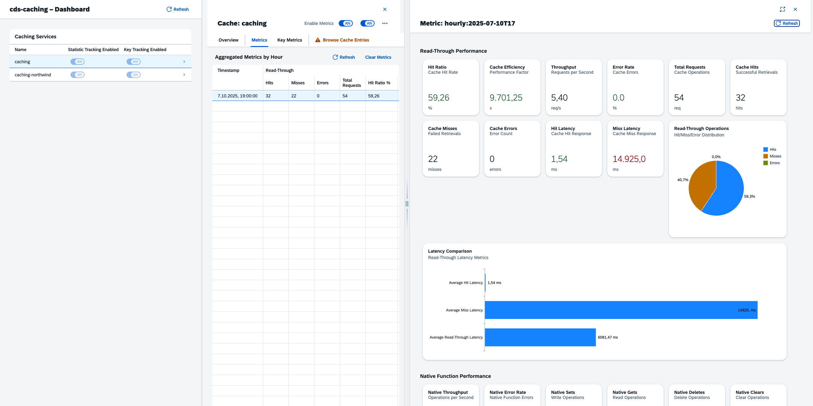

# Welcome to cds-caching
[](https://www.npmjs.com/package/cds-caching/common)
[](https://www.npmjs.com/package/cds-caching)

## Overview

A caching plugin for the [SAP Cloud Application Programming Model (CAP)](https://cap.cloud.sap/docs/) that improves performance by caching slow remote service calls, complex operations, and queries.

Please also read the introduction blog post: [Boosting performance in SAP Cloud Application Programming Model (CAP) applications with cds-caching](https://community.sap.com/t5/technology-blogs-by-members/boosting-performance-in-sap-cloud-application-programming-model-cap/ba-p/14002015).

### Key Features

* **Read-Through Caching** – Transparently cache CQN queries, CAP requests, or function calls
* **Pluggable Storage** – In-memory, SQLite, Redis, PostgreSQL, SAP HANA, or CDS database
* **Multi-Tenancy** – Automatic tenant isolation for SAP BTP MTX deployments
* **TTL & Tag Support** – Time-based expiry and tag-based invalidation
* **Compression** – LZ4 or GZIP compression for cached data
* **Metrics & Monitoring** – Hit rates, latencies, key-level tracking, and an OData API
* **Annotations** – Declarative caching via `@cache` annotations on entities and functions

### Documentation

| Guide | Description |
|-------|-------------|
| [Programmatic API](docs/programmatic-api.md) | Full API reference for cache operations |
| [Key Management](docs/key-management.md) | Key templates, context awareness, custom keys |
| [Metrics Guide](docs/metrics-guide.md) | Statistics, monitoring, and performance tracking |
| [OpenTelemetry Integration](docs/telemetry.md) | Distributed tracing and metrics export |
| [OData API](docs/odata-api.md) | REST endpoints for management and monitoring |
| [Deployment Guide](docs/deployment-guide.md) | SAP BTP deployment for Redis, PostgreSQL, HANA, CDS |
| [Migration Guide](docs/migration-guide.md) | Upgrading from 0.x to 1.x and 1.1 to 1.2 |
| [Example Application](docs/example-app.md) | Sample app with dashboard |

## Getting Started

### Installation

```bash
npm install cds-caching
```

### Minimal Configuration

```json
{
  "cds": {
    "requires": {
      "caching": {
        "impl": "cds-caching"
      }
    }
  }
}
```

This uses the in-memory store — no additional setup needed for development.

### Data Model

The plugin ships CDS entity definitions for database-backed features. These are **auto-loaded conditionally** based on your configuration — no manual `model` property or `using from` needed:

| Condition | Entities loaded | Purpose |
|-----------|----------------|---------|
| `statistics` block present | `Caches`, `Metrics`, `KeyMetrics` | Persist metrics and runtime config to the database |
| `store: 'cds'` | `CacheStore` | Key-value table used by the CDS store adapter |
| `using from 'cds-caching/index.cds'` | `CachingApiService` + statistics entities | OData API for the [dashboard](docs/example-app.md) |
| None of the above | Nothing | Plugin works with external stores only |

The auto-loading works by injecting the relevant CDS files into `cds.env.roots` at plugin load time, before CAP compiles the model. This means `cds deploy` and `cds build` automatically pick up the required tables.

### Basic Usage

```javascript
const cache = await cds.connect.to("caching")

// Key-value operations
await cache.set("bp:1000001", businessPartnerData, { ttl: 60000 })
const data = await cache.get("bp:1000001")

// Read-through caching for CQN queries
const { result } = await cache.rt.run(query, db, { ttl: 30000 })

// Read-through caching for remote services
const { result } = await cache.rt.send(request, remoteService, { ttl: 10000 })

// Function caching
const cachedFn = cache.rt.wrap("expensive-op", expensiveFunction, { ttl: 3600 })
const { result } = await cachedFn("param1")
```

### Annotation-Based Caching

```cds
service MyService {
  @cache: { ttl: 10000 }
  entity Products as projection on db.Products;

  @cache: { ttl: 60000 }
  function getRecommendations() returns array of Products;
}
```

## Configuration

### Store Types

| Store | Config | Use Case | Adapter Package |
|-------|--------|----------|-----------------|
| In-Memory | `"memory"` | Development, small-scale | Built-in |
| SQLite | `"sqlite"` | Medium-size, single instance | `@resolid/keyv-sqlite` or `@keyv/sqlite` |
| Redis | `"redis"` | Production, distributed | `@keyv/redis` |
| PostgreSQL | `"postgres"` | Production, when Redis unavailable | `@keyv/postgres` |
| CDS Database | `"cds"` | Production, HANA, multi-tenant | None (uses app's DB) |
| SAP HANA | `"hana"` | Direct HANA connection | `keyv-hana` |

> **Recommendation**: Use `store: 'cds'` for CAP applications on SAP HANA — it reuses your app's DB connection, requires no extra packages, and supports multi-tenancy automatically. Use `store: 'redis'` for best performance in distributed setups.

### Full Configuration Options

```json
{
  "cds": {
    "requires": {
      "caching": {
        "impl": "cds-caching",
        "namespace": "caching",
        "store": "redis",
        "compression": "lz4",
        "throwOnErrors": false,
        "transactionalOperations": false,
        "credentials": { },
        "statistics": {
          "enabled": true,
          "persistenceInterval": 60000
        },
        "keyManagement": {
          "isUserAware": false,
          "isTenantAware": false,
          "isLocaleAware": false
        }
      }
    }
  }
}
```

| Option | Default | Description |
|--------|---------|-------------|
| `store` | `"memory"` | Storage backend (`memory`, `sqlite`, `redis`, `postgres`, `hana`, `cds`) |
| `namespace` | service name | Key prefix for store isolation |
| `compression` | none | `"lz4"` or `"gzip"` |
| `throwOnErrors` | `false` | Whether basic operations throw on cache errors |
| `transactionalOperations` | `false` | Isolate basic ops in dedicated cache transactions |
| `statistics` | none | When present, auto-loads the statistics data model and enables persistence (see [Statistics & Monitoring](#statistics--monitoring)) |
| `statistics.enabled` | `false` | Enable metrics collection |
| `statistics.persistenceInterval` | `60000` | Interval (ms) for persisting hourly stats to the database |
| `keyManagement.isTenantAware` | `false` (auto `true` in MTX) | Include tenant in cache keys |
| `keyManagement.isUserAware` | `false` | Include user in cache keys |
| `keyManagement.isLocaleAware` | `false` | Include locale in cache keys |

### Environment-Specific Configuration

```json
{
  "cds": {
    "requires": {
      "caching": {
        "impl": "cds-caching",
        "store": "redis",
        "[development]": {
          "credentials": { "host": "localhost", "port": 6379 }
        },
        "[production]": {
          "credentials": { "url": "redis://production-redis:6379" }
        }
      }
    }
  }
}
```

For detailed key configuration and deployment instructions, see [Key Management](docs/key-management.md) and [Deployment Guide](docs/deployment-guide.md).

### Service Integration

The plugin includes `CachingApiService`, an OData service for managing caches, browsing entries, and viewing metrics. It powers the [dashboard application](docs/example-app.md) and can be consumed by any OData client.

To expose this service, reference it in one of your `.cds` files so CAP serves it:

```cds
using {plugin.cds_caching.CachingApiService} from 'cds-caching/index.cds';

annotate CachingApiService with @requires: 'authenticated-user';
```

This automatically loads the required database entities (`Caches`, `Metrics`, `KeyMetrics`) via a transitive `using from` dependency — no additional configuration needed. Without this step, the service won't be served by CAP and the dashboard won't work.

## Multi-Tenancy (MTX)

cds-caching supports SAP BTP multi-tenant applications using `@sap/cds-mtxs`. When multitenancy is detected, the plugin automatically:

- Enables **tenant-aware cache keys** (`{tenant}:{hash}`)
- **Defers database operations** to request-time (avoids startup crashes without tenant context)
- **Guards statistics persistence** to only run within a tenant request context

### Recommended Setup

```json
{
  "cds": {
    "requires": {
      "multitenancy": true,
      "caching": {
        "impl": "cds-caching",
        "store": "cds"
      }
    }
  }
}
```

With `store: 'cds'`, each tenant's cache data lives in its own HDI container — fully isolated by CAP's Service Manager.

Alternatively, use `store: 'redis'` for shared Redis with automatic tenant-prefixed keys:

```json
{
  "cds": {
    "requires": {
      "multitenancy": true,
      "caching": {
        "impl": "cds-caching",
        "store": "redis",
        "credentials": { "socket": { "host": "localhost", "port": 6379 } }
      }
    }
  }
}
```

> `isTenantAware` is automatically set to `true` in MTX mode. Set `"isTenantAware": false` in `keyManagement` to explicitly opt out.

## Usage Patterns

> **Deprecation Notice**: `cache.run()`, `cache.send()`, `cache.wrap()`, `cache.exec()` are deprecated since v1.0. Use `cache.rt.run()`, `cache.rt.send()`, `cache.rt.wrap()`, `cache.rt.exec()` instead. See [Migration Guide](docs/migration-guide.md).

### Read-Through Query Caching

```javascript
const { result } = await cache.rt.run(
  SELECT.from(BusinessPartners).where({ type: '2' }), 
  db, 
  { ttl: 30000 }
)
```

### Read-Through Remote Service Caching

```javascript
this.on('READ', BusinessPartners, async (req, next) => {
  const bupa = await cds.connect.to('API_BUSINESS_PARTNER')
  const { result } = await cache.rt.run(req, bupa, { ttl: 30000 })
  return result
})
```

### ApplicationService Caching with `prepend`

```javascript
this.prepend(() => {
  this.on('READ', MyEntity, async (req, next) => {
    const cache = await cds.connect.to("caching")
    const { result } = await cache.rt.run(req, next)
    return result
  })
})
```

### Function Caching

```javascript
// Wrap: create a cached version of a function
const cachedFn = cache.rt.wrap("bp-data", fetchBPData, { ttl: 3600, tags: ['bp'] })
const { result } = await cachedFn("1000001", true)

// Exec: immediate one-off execution with caching
const { result } = await cache.rt.exec("product", fetchProduct, ["1000001"], { ttl: 3600 })
```

### Cache Invalidation

```javascript
// Time-based (TTL)
await cache.set("key", value, { ttl: 60000 })

// Key-based
await cache.delete("bp:1000001")

// Tag-based
await cache.set("bp:1000001", data, { tags: [{ value: "bp-list" }] })
await cache.set("bp:1000002", data, { tags: [{ value: "bp-list" }] })
await cache.deleteByTag("bp-list")

// Dynamic tags from data
await cache.set("bp-list", bpArray, { 
  tags: [{ data: "businessPartner", prefix: "bp-" }] 
})
```

For more usage patterns, error handling details, and TypeScript support, see [Programmatic API](docs/programmatic-api.md).

## Statistics & Monitoring

To persist metrics to the database, add a `statistics` block to your configuration. This automatically loads the required data model (`Caches`, `Metrics`, `KeyMetrics` tables):

```json
{
  "cds": {
    "requires": {
      "caching": {
        "impl": "cds-caching",
        "store": "redis",
        "statistics": {
          "enabled": true,
          "persistenceInterval": 60000
        }
      }
    }
  }
}
```

You can also enable metrics at runtime:

```javascript
const cache = await cds.connect.to("caching")
await cache.setMetricsEnabled(true)
await cache.setKeyMetricsEnabled(true)

const stats = await cache.getCurrentMetrics()
```

The plugin includes an [example dashboard](docs/example-app.md) for visualizing cache performance:



[See the full Metrics Guide →](docs/metrics-guide.md)

## API Reference

| API | Description |
|-----|-------------|
| [Programmatic API](docs/programmatic-api.md) | JavaScript methods for cache operations |
| [OData API](docs/odata-api.md) | REST endpoints for monitoring and management |

## Contributing

Contributions are welcome! Please submit pull requests to the [repository](https://github.com/mikezaschka/cds-caching).

## License

This project is licensed under the MIT License - see the LICENSE file for details.
