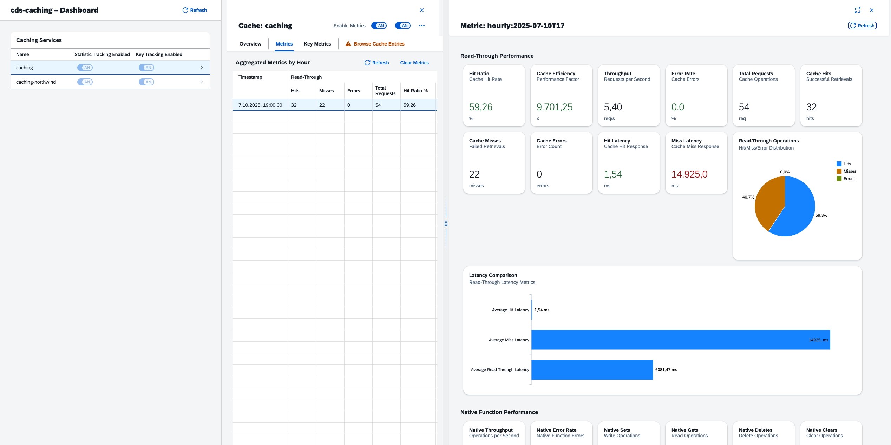

# Dashboard

The cds-caching plugin includes a pre-built UI5 dashboard for monitoring cache performance. You can add it to any CAP project with a single command.

> **Which option should I use?** See the [Feature Activation Guide](feature-activation.md) for reuse vs own activation (`metrics.reuse`, `cds add caching-metrics`, or `using … index.cds`).



## Quick Start

```bash
cds add caching-metrics
```

(`cds add caching-dashboard` is a deprecated alias — same behavior.)

By default this copies a **pre-built** UI5 app — ready for `cds watch` and for BTP/HTML5 repo deployment without extra setup. The app loads the UI5 runtime from the SAPUI5 CDN rather than bundling it.

To copy **TypeScript source** instead (for customizing views, controllers, and styles), use:

```bash
cds add caching-metrics --source
```

Then install UI5 tooling dependencies and start your application:

```bash
cd app/caching-dashboard && npm install && cd ../..
cds watch
```

The dashboard is available at [http://localhost:4004/caching-dashboard/index.html](http://localhost:4004/caching-dashboard/index.html).

## Zero-config reuse (CAP reuse & compose)

To activate the API and dashboard from the installed package without copying files — following CAP's [reuse & compose](https://cap.cloud.sap/docs/guides/integration/reuse-and-compose#reuse-uis) pattern — set `metrics.reuse` on your caching configuration:

```json
{
  "cds": {
    "requires": {
      "caching": {
        "impl": "cds-caching",
        "metrics": {
          "enabled": true,
          "persistenceInterval": 60000,
          "reuse": {
            "api": true,
            "dashboard": true
          }
        }
      }
    }
  }
}
```

With these flags the plugin automatically:

- registers `CachingApiService` (no `srv/caching-api.cds` needed), and
- serves the pre-built UI at `/caching-dashboard` from the plugin package.

Use **either** `metrics.reuse.dashboard` **or** `cds add caching-metrics`, not both. See [Feature Activation](feature-activation.md).

> **Removed in 3.0:** `dashboard: true` and `statistics` are no longer accepted. Use `metrics` / `metrics.reuse` — see [Upgrading to 3.0](migration-guide.md#upgrading-to-30).

### Where the UI5 runtime comes from

Since 3.0 the dashboard loads UI5 from the public SAPUI5 CDN at a pinned version, instead of bundling the runtime. That took the published package from roughly 196 MB to under 1 MB, and stopped `cds add` from copying a second copy of the runtime into your project.

The browser therefore needs to reach `https://ui5.sap.com`. If it cannot — an air-gapped landscape, or a Content Security Policy that permits only same-origin scripts — point the dashboard at a UI5 runtime you serve yourself:

```json
{
  "cds": {
    "requires": {
      "caching": {
        "impl": "cds-caching",
        "metrics": {
          "reuse": { "dashboard": true },
          "ui5Url": "/ui5/resources/sap-ui-core.js"
        }
      }
    }
  }
}
```

`ui5Url` accepts an absolute `https://` URL or a same-origin absolute path. Anything else is ignored with a startup warning, and the pinned CDN URL is used. Pin a version in your own URL too: an unpinned runtime upgrades itself underneath a released dashboard.

If you would rather not depend on a CDN at all, use `cds add caching-metrics --source` and build the app yourself, which is also the recommended route for productive BTP deployments.

> **Production note:** `metrics.reuse.dashboard` serves static files from the CAP Node.js server. On standard BTP (HTML5 repo + approuter), use `cds add caching-metrics` instead. See [issue #24](https://github.com/mikezaschka/cds-caching/issues/24).

## Prerequisites

The dashboard requires `CachingApiService` and a `metrics` configuration block so that metrics are collected and persisted.

```json
"metrics": {
  "enabled": true,
  "persistenceInterval": 60000
}
```

See the [Metrics Guide](metrics-guide.md) for details on metrics configuration.

## What Gets Created

Running `cds add caching-metrics` (or `cds add caching-dashboard`) adds the following to your project:

| Path | Purpose |
|------|---------|
| `app/caching-dashboard/webapp/` | UI5 dashboard application (pre-built by default, TypeScript source with `--source`; loads UI5 from the CDN either way) |
| `app/caching-dashboard/ui5.yaml` | UI5 build configuration |
| `app/caching-dashboard/ui5-deploy.yaml` | BTP/HTML5 Application Repository build config (`ui5-task-zipper`) |
| `app/caching-dashboard/xs-app.json` | Approuter routing for HTML5 App Repo deployments |
| `app/caching-dashboard/package.json` | `start`, `build`, and `build:cf` scripts for the UI app |
| `app/caching-dashboard/tsconfig.json` | TypeScript configuration (only with `--source`) |
| `srv/caching-api.cds` | Exposes the `CachingApiService` OData API |

Existing files are never overwritten, so your customizations and deploy settings are safe across re-runs (except `app/caching-dashboard/webapp/`, which is refreshed — see [Updating](#updating)).

The `srv/caching-api.cds` file contains a single `using` statement that tells CAP to serve the plugin's OData API:

```cds
using {plugin.cds_caching.CachingApiService} from 'cds-caching/index.cds';
```

This also transitively loads the required database entities (`Caches`, `Metrics`, `KeyMetrics`).

## Features

- **Real-time Metrics** -- View cache hit rates, latencies, and throughput
- **Key-level Analytics** -- Monitor performance for individual cache keys
- **Historical Data** -- Analyze trends over time with hourly/daily aggregations
- **Cache Management** -- Clear caches, view entries, and manage configurations
- **Multi-cache Support** -- Monitor multiple caching services simultaneously

## Securing the Dashboard

Since 2.1.0 `CachingApiService` requires an authenticated user by default, and the `/caching-dashboard` static route (when served via `metrics.reuse.dashboard`) is guarded the same way. Unauthenticated callers get `401`.

**That default is a floor, not a production setting** — every logged-in user of your application satisfies `authenticated-user`, and this API can list cache entries and perform destructive operations (`clear`, `deleteEntry`, …). Restrict it to an administrative role:

```cds
annotate plugin.cds_caching.CachingApiService with @requires: 'CacheAdmin';
```

Your annotation is a downstream layer, so it replaces the plugin default. See [Security](security.md) for the full checklist.

On BTP, `cds add caching-dashboard` additionally generates an `xs-app.json` with `authenticationType: "xsuaa"` for both the UI and `/odata/v4/caching-api/*`.

> **Local development:** with CAP's mocked authentication the dashboard now prompts for credentials. Define users under `cds.requires.auth` to log in during `cds watch`.

> **Important:** annotate the fully-qualified name (`plugin.cds_caching.CachingApiService`) and do **not** repeat the `using {plugin.cds_caching.CachingApiService} from 'cds-caching/index.cds';` import. Importing the same service name twice in the same model causes a `Duplicate definition of CachingApiService` error at startup (see [issue #24](https://github.com/mikezaschka/cds-caching/issues/24)). The fully-qualified `annotate` needs no `using` and works in any `.cds` file under `srv/`.

## Deploying the Dashboard

How you deploy the dashboard depends on your runtime topology:

**1. CAP backend serves the UI (simplest).** If your CAP server serves static content itself, use `metrics.reuse.dashboard` — nothing extra to deploy.

**2. SAP BTP with HTML5 App Repository + approuter (standard productive setup).** Use `cds add caching-metrics` — do not set `metrics.reuse.dashboard`.

Install dependencies and verify the UI5 build from the app folder:

```bash
cd app/caching-dashboard && npm install
npm run build:cf
```

Then wire the app into your MTA deployment with the standard CAP facets:

```bash
cds add html5-repo
cds add mta          # or: cds add approuter
```

The generated `xs-app.json` forwards `/odata/v4/caching-api/*` to the CAP backend via the `srv-api` destination (created by `cds add mta`) and serves the UI from `html5-apps-repo-rt`. Adjust the destination name if yours differs, and secure the service (see [Securing the Dashboard](#securing-the-dashboard)).

**3. ABAP front-end server.** Generate an ABAP deploy configuration with `npx -p @sap/ux-ui5-tooling fiori add deploy-config abap` from `app/caching-dashboard/` (this creates a separate ABAP-specific deploy config alongside the HTML5 repo template).

> The shipped dashboard loads the SAPUI5 runtime from the public CDN at a pinned version. See [Where the UI5 runtime comes from](#where-the-ui5-runtime-comes-from) to serve it yourself instead.

## Customization

The dashboard files copied into `app/caching-dashboard/webapp/` are fully owned by your project.

**Default (pre-built):** Works immediately with `cds watch`, but controllers are transpiled and minified JavaScript — fine for deployment, awkward for deep UI changes.

**Source mode (`--source`):** Copies the original TypeScript sources, `tsconfig.json`, and a `ui5.yaml` with transpile middleware. Run `npm install` in `app/caching-dashboard/` before `cds watch` or `npm start`. Local development uses the SAPUI5 CDN; run `npm run build:cf` from that folder before deploying to the HTML5 Application Repository.

Re-running `cds add caching-metrics` (with or without `--source`) refreshes `webapp/` from the installed plugin version.

## Updating

To update the dashboard to the latest version shipped with cds-caching, re-run the same command you used initially:

```bash
cds add caching-metrics           # pre-built
cds add caching-metrics --source  # TypeScript source
```

This overwrites the files in `app/caching-dashboard/webapp/` with the latest build. If you have made local modifications, back them up before updating.

## Manual Setup

If you prefer not to use `cds add`, you can integrate the dashboard manually:

1. Copy the pre-built dashboard from `node_modules/cds-caching/app/dashboard/` into your project's `app/caching-dashboard/webapp/` directory. It bootstraps UI5 from the CDN; edit the `sap-ui-bootstrap` script tag in `index.html` to point elsewhere.

2. Create `srv/caching-api.cds` with:

```cds
using {plugin.cds_caching.CachingApiService} from 'cds-caching/index.cds';
```

3. Run `cds watch` -- CAP auto-detects the app folder and serves the dashboard.
