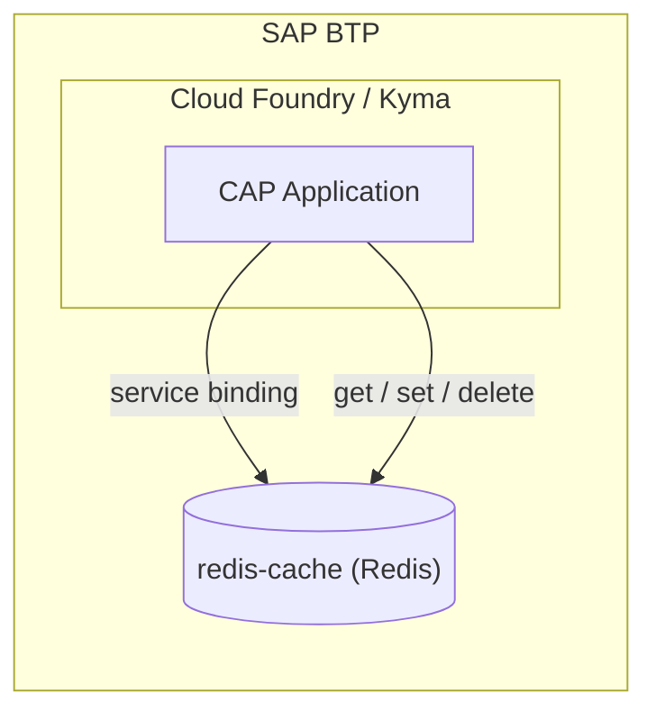
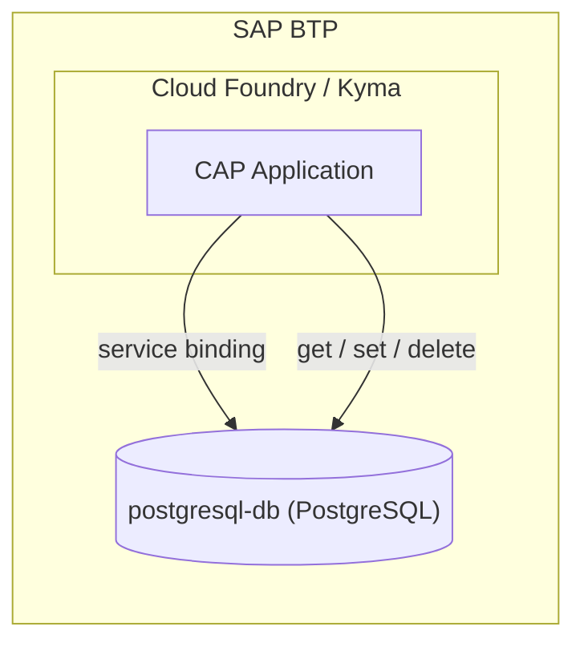
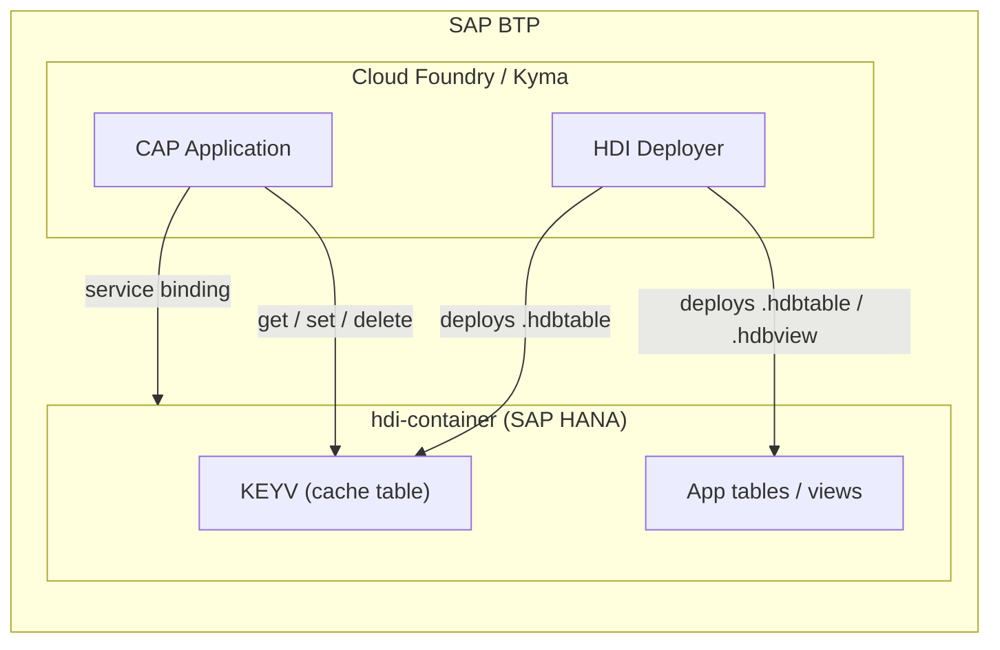
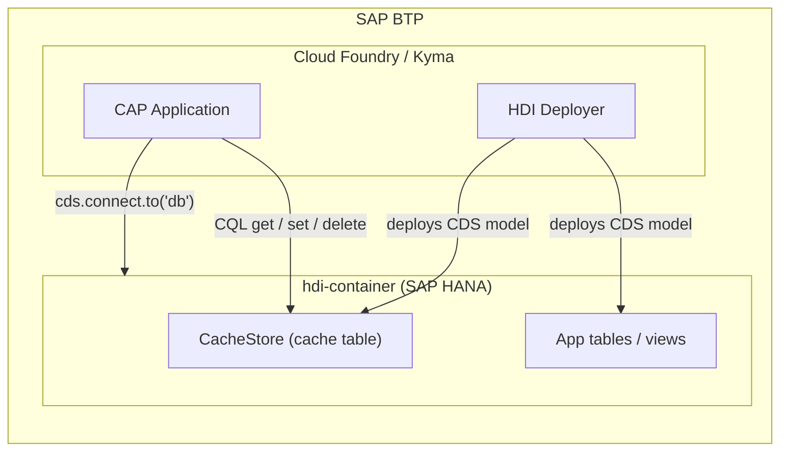

# Deployment Guide

This guide covers deploying cds-caching with different storage backends on SAP BTP.

## Redis on SAP BTP



Redis can be provisioned as a managed service through the Redis on SAP BTP hyperscaler option. An instance can be provisioned via trial or even as a Free Tier.

### Configuration

```json
{
  "cds": {
    "requires": {
      "caching": {
        "impl": "cds-caching",
        "namespace": "myCache",
        "store": "redis",
        "[development]": {
          "credentials": {
            "host": "localhost",
            "port": 6379
          }
        }
      }
    }
  }
}
```

### MTA Configuration

```yaml
modules:
  - name: cap-app-srv
    requires:
      - name: redis-cache

resources:
  - name: redis-cache
    type: org.cloudfoundry.managed-service
    parameters:
      service: redis-cache
      service-plan: trial
      service-tags:
        - cds-caching
```

> There is a detailed [blog series on Redis in SAP BTP](https://community.sap.com/t5/technology-blogs-by-sap/redis-on-sap-btp-understanding-service-entitlements-and-metrics/ba-p/13738371) explaining how to set up Redis and connect via SSH for local/hybrid testing.

## PostgreSQL on SAP BTP



PostgreSQL is available on SAP BTP as a hyperscaler option. The credentials are automatically injected via service bindings.

### Configuration

```json
{
  "cds": {
    "requires": {
      "caching": {
        "impl": "cds-caching",
        "store": "postgres",
        "[development]": {
          "credentials": {
            "host": "localhost",
            "port": 5432,
            "user": "postgres",
            "password": "postgres",
            "database": "cache"
          }
        }
      }
    }
  }
}
```

### MTA Configuration

```yaml
modules:
  - name: cap-app-srv
    requires:
      - name: postgres-cache

resources:
  - name: postgres-cache
    type: org.cloudfoundry.managed-service
    parameters:
      service: postgresql-db
      service-plan: trial
      service-tags:
        - cds-caching
```

On SAP BTP, the bound credentials are automatically resolved by CAP into `cds.requires.caching.credentials`. No `[production]` credentials block is needed.

## SAP HANA via keyv-hana



> **Note**: For CAP applications, consider using `store: 'cds'` instead. It uses CAP's managed DB connection, supports multi-tenancy automatically, and requires no additional adapter packages.

### Prerequisites

```bash
npm install keyv-hana @sap/hana-client
```

### Configuration

```json
{
  "cds": {
    "requires": {
      "caching": {
        "impl": "cds-caching",
        "store": "hana",
        "[development]": {
          "credentials": {
            "host": "localhost",
            "port": 30015,
            "uid": "SYSTEM",
            "pwd": "YourPassword",
            "table": "KEYV",
            "createTable": true
          }
        }
      }
    }
  }
}
```

For development, you can set `createTable: true` to have the adapter create the table automatically. For production HDI deployments, leave it as `false` (the default) and let the HDI deployer handle table creation.

### HDI Table Artifact

When `store` is set to `"hana"`, `cds-caching` automatically registers a build plugin that generates the `.hdbtable` artifact during `cds build`. The generated file is placed in the db module's build output (`src/gen/`) and will be deployed by the HDI deployer.

| Option    | Default | Description                          |
| --------- | ------- | ------------------------------------ |
| `table`   | `KEYV`  | Name of the HANA column table       |
| `keySize` | `255`   | Max key column length (NVARCHAR size)|

The generated `.hdbtable` artifact looks like this:

```sql
COLUMN TABLE "KEYV" (
  "ID" NVARCHAR(255) PRIMARY KEY,
  "VALUE" NCLOB
)
```

### MTA Configuration

```yaml
modules:
  - name: cap-app-srv
    requires:
      - name: hana-hdi

  - name: cap-app-db-deployer
    type: hdb
    path: gen/db
    requires:
      - name: hana-hdi

resources:
  - name: hana-hdi
    type: com.sap.xs.hdi-container
    parameters:
      service-tags:
        - cds-caching
```

On SAP BTP, the bound HDI container credentials are automatically resolved by CAP. The adapter maps BTP credential fields (`user`/`password`) to the HANA client fields (`uid`/`pwd`) and forwards TLS options automatically.

> Since `createTable` defaults to `false`, the adapter is HDI-ready out of the box. The runtime user (`_RT`) only performs DML operations; the HDI deployer handles all DDL via the design-time user (`_DT`).

## CDS Database on SAP BTP



The CDS store adapter (`store: 'cds'`) uses CAP's managed database connection. No separate credentials or adapter packages are needed.

### Configuration

```json
{
  "cds": {
    "requires": {
      "caching": {
        "impl": "cds-caching",
        "store": "cds"
      }
    }
  }
}
```

### How it works

- The `CacheStore` entity is defined in the plugin's `index.cds` and becomes part of your CDS model
- **SQLite**: Table created automatically by `cds deploy`
- **SAP HANA**: Table deployed by the HDI deployer as part of your regular `cds build` / deploy pipeline
- **PostgreSQL**: Table created automatically by the `@cap-js/postgres` adapter
- **Multi-tenant (MTX)**: CAP's Service Manager automatically routes each tenant to its own HDI container

### MTA Configuration

No additional MTA resources are needed. The cache table is deployed into the same HDI container as your application tables:

```yaml
modules:
  - name: cap-app-srv
    requires:
      - name: hana-hdi

  - name: cap-app-db-deployer
    type: hdb
    path: gen/db
    requires:
      - name: hana-hdi

resources:
  - name: hana-hdi
    type: com.sap.xs.hdi-container
```

## Redis Development Setup

For local development, Redis can be quickly set up using Docker:

1. Create a `docker-compose.yml` file:
```yaml
services:
  redis:
    image: redis:latest
    container_name: local-redis
    ports:
      - "6379:6379"
```

2. Run Redis with: 
```bash
docker compose up -d
```
