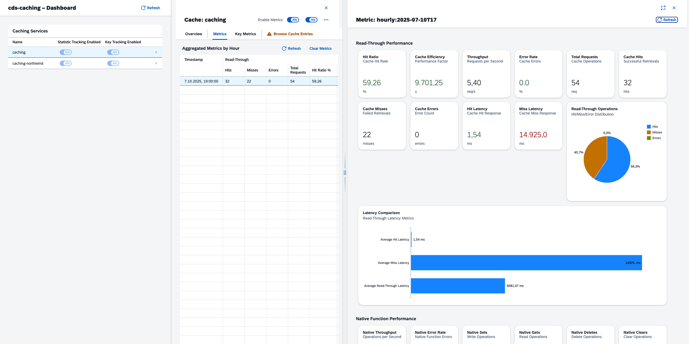

# Example Application

The cds-caching plugin includes a comprehensive example application that demonstrates various caching use cases and provides a UI5-based dashboard for monitoring cache performance.

## Example App Overview

The example application consists of two main components:

1. **Backend Application** (`examples/app/`) - A CAP application demonstrating caching patterns
2. **Dashboard** (`examples/dashboard/`) - A UI5-based monitoring interface



## Backend Application Use Cases

The example app demonstrates several caching scenarios:

### 1. Application Service Caching with Annotations

```cds
@cache: {
    service: 'caching',
    ttl: 5000,
    key: '{hash}_{user}',
    tags: [
        {template: 'user-{user}'},
        {data: 'name', prefix: 'foo-'}
    ]
}
@cds.redirection.target: Bar
entity CachedFoo as projection on Foo;
```

### 2. Remote Service Caching

```cds
@cache: {
    service: 'caching-northwind',
    ttl: 5000
}
@readonly
entity Products as projection on Northwind.Products;
```

### 3. Programmatic Caching in Service Handlers

```javascript
class AppService extends cds.ApplicationService {
    async init() {
        this.on('READ', Products, async (req) => {
            const northwind = await cds.connect.to("Northwind");
            return northwind.run(req.query);
        });
        
        // Manual caching with custom logic
        this.on('getCachedValue', async (req) => {
            const data = req.data;
            return `cached value ${data.param1}`;
        });
        
        return super.init()
    }
}
```

## UI5 Dashboard Features

The dashboard provides comprehensive monitoring capabilities:

- **Real-time Metrics**: View cache hit rates, latencies, and throughput
- **Key-level Analytics**: Monitor performance for individual cache keys
- **Historical Data**: Analyze trends over time with hourly/daily aggregations
- **Cache Management**: Clear caches, view entries, and manage configurations
- **Multi-cache Support**: Monitor multiple caching services simultaneously

## Running the Example

### 1. Deploy the Backend

```bash
cd examples/app
cds deploy
```

### 2. Start the Dashboard

```bash
cd examples/dashboard
DEBUG=cds-caching npm start
```

### 3. Access the Dashboard

Open http://localhost:8080/index.html

### 4. Activate Metrics

Enable key tracking for caches `caching` and `caching-northwind` through the dashboard or API.

### 5. Test Caching

Use the provided `requests.http` file to create requests that trigger cache operations, or start a REPL session:

```bash
cd examples/app
cds repl --run cds-caching-example-app

const caching = await cds.connect.to("caching")
await caching.set("mykey", "myvalue", { ttl: 5000 })
```

## Example Caching Patterns

### Basic Operations

```javascript
// Set a value with TTL
await caching.set("mykey", "myvalue", { ttl: 5000 })

// Read-through query execution
const { result } = await caching.rt.run(SELECT.from("AppService.Foo"), db, { ttl: 5000 })

// Remote service caching
const { result } = await caching.rt.run(SELECT("Products").limit(2), Northwind)
```

### Context-Aware Caching

```javascript
// Set user context
cds.context = { user: { id: "mike" }, tenant: "t1", locale: "de" }

// Cache with custom key template
await caching.rt.run(SELECT.from("AppService.Foo"), db, { 
    ttl: 5000, 
    key: "{locale}:{user}:{hash}" 
})
```

## Advanced Usage Examples

### Read-Through Query Execution

```javascript
// Read through query execution
await caching.run(SELECT.from("AppService.Foo"), db, { ttl: 5000 })

// Read through query execution with extended return values
await caching.rt.run(SELECT.from("AppService.Foo"), db, { ttl: 5000 })

// Set the context
cds.context = { user: { id: "mike" }, tentant: "t1", locale: "de"  }

// Apply a different key
await caching.rt.run(SELECT.from("AppService.Foo"), db, { ttl: 5000, key: "{locale}:{user}:{hash}" })
```

### Read-Through Requests

```javascript
// Request local data
await caching.rt.run(SELECT.from("AppService.Foo"), AppService, { ttl: 5_000 })

// Request products from remote service through the app service
await caching.rt.run(SELECT.from("AppService.Products"), AppService, { ttl: 5_000 })

// Directly call the remote service
await caching.rt.run(SELECT("Products").limit(2), Northwind);

// Send a REST request
await caching.rt.send({ method: 'GET', path: '/Products' }, Northwind);
```

### Basic Operations

```javascript
// Set a value
await caching.set("mykey", "myvalue")

// Read the value
await caching.get("mykey")

// Delete the value
await caching.delete("mykey")

// Provide a ttl
await caching.set("mykey", "myvalue", { ttl: 5000 }) // 5 seconds
``` 